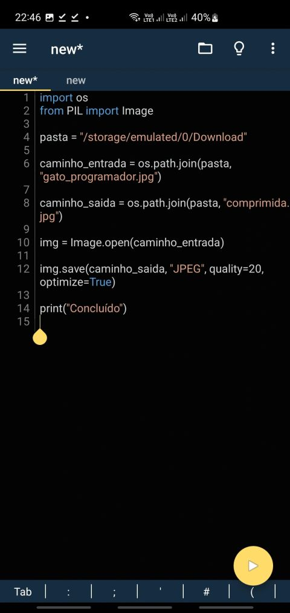
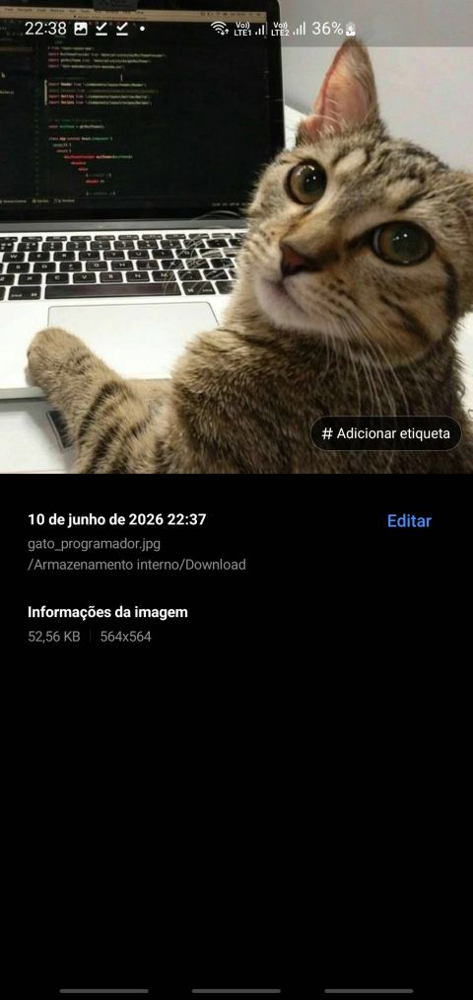

# Compressor de Imagens para Android (Pydroid 3)

[🇺🇸 English](README.md) | 🇧🇷 Português

Um script simples em Python para comprimir imagens diretamente em dispositivos Android utilizando o Pydroid 3.

Projeto desenvolvido inteiramente em um smartphone Android utilizando Python e Pydroid 3.

## Screenshots

### Execução do Programa

> Execução do script no Pydroid 3.

### Imagem antes de ser comprimida

> Imagem antes da compressão (aproximadamente 2,5 MB).
> Imagem pertencente a Tai Bui, baixada na plataforma Unsplash (https://unsplash.com/pt-br/fotografias/um-gato-deitado-em-cima-de-um-computador-portatil-393l7SYoM7w?utm_source=unsplash&utm_medium=referral&utm_content=creditShareLink)

### Imagem comprimida

> Resultado após a execução do script. Observe a redução significativa do tamanho do arquivo mantendo uma qualidade visual satisfatória.

## 📖 Motivação

Criei este projeto enquanto configurava meu currículo na Plataforma Lattes. O sistema exigia uma foto de perfil com tamanho máximo de aproximadamente 70 KB, mas a imagem que eu possuía ultrapassava 300 KB.

Naquele momento, eu estava longe do computador e tinha apenas meu celular com conexão 4G. Em vez de baixar um aplicativo ou enviar minha foto para um serviço online de compressão, decidi criar minha própria ferramenta para resolver o problema.

Além de atender à necessidade imediata, o projeto serviu como uma oportunidade prática para aplicar conceitos de programação e aprender mais sobre manipulação de imagens em Python.

## 🚀 Funcionalidades

* Compressão de imagens JPEG utilizando Python;
* Ajuste do nível de qualidade da imagem;
* Geração de uma nova imagem comprimida sem alterar o arquivo original;
* Execução diretamente em dispositivos Android por meio do Pydroid 3;
* Não requer conexão com a internet;
* Não depende de serviços externos para processamento das imagens.

## 🛠️ Tecnologias Utilizadas

* Python 3
* Pillow (PIL)
* Pydroid 3

## ⚙️ Como Funciona

O script realiza os seguintes passos:

1. Define o diretório onde a imagem está armazenada;
2. Carrega a imagem selecionada utilizando a biblioteca Pillow;
3. Aplica a compressão com o nível de qualidade configurado pelo usuário;
4. Salva uma nova versão comprimida da imagem;
5. Mantém o arquivo original intacto.

## 📊 Exemplo de Uso

Imagem original:

* Tamanho superior a 300 KB

Imagem comprimida:

* Tamanho reduzido conforme o nível de qualidade definido
* Valor de qualidade recomendado: entre 20 e 75

## Como usar:

1. Clone o repositório
2. Abra o Compressor.py em um editor
3. Na variável 'pasta', substitua a string pelo diretório da pasta onde está a foto que você deseja comprimir
4. Na variável 'foto', substitua a string 'NOME DA FOTO' pelo nome da foto que você deseja comprimir (Não esqueça do .jpg no final)
5. Em img.save, altere o valor do parâmetro 'quality' para o nível de qualidade que você quer. Recomendo algo entre 20 e 75. Quanto mais baixo o valor, mais leve a imagem, mas com menos qualidade e vice versa.
6. Execute o programa
7. Procure a imagem no seu celular (Minha recomendação: Não use o aplicativo da galeria por motivos já explicados nesse README. Use o explorador de arquivos do seu celular e vá para a pasta onde as fotos estão)

## 📚 O Que Aprendi

Durante os testes, percebi que as imagens geradas pelo script nem sempre apareciam imediatamente na galeria do Android.

Ao investigar o problema, descobri que o sistema utiliza um processo chamado **Media Scanner**, responsável por atualizar o banco de dados de mídia do dispositivo. Como o Python salva os arquivos diretamente no armazenamento, o Android pode levar algum tempo para reconhecer que uma nova imagem foi criada.

Como solução temporária, utilizei o explorador de arquivos para acessar diretamente a pasta onde as imagens comprimidas eram salvas.

Essa experiência me permitiu aprender não apenas sobre manipulação de imagens em Python, mas também sobre o funcionamento do sistema de arquivos e do gerenciamento de mídia no Android.

## 🔮 Melhorias Futuras

* Transformar o código em funções reutilizáveis;
* Adicionar tratamento de erros;
* Suportar outros formatos de imagem;
* Implementar conversão automática para JPEG quando necessário;
* Investigar formas de atualizar automaticamente a galeria após a criação da imagem;
* Desenvolver uma interface gráfica simples para facilitar o uso.
* Resolver bug de concatenação JPG com o nome do arquivo original e o nome do arquivo após a compressão (Exemplo: Após comprimido, o arquivo pode ficar salvo como algo parecido como "foto.jpg comprimida.jpg")

## 💡 Por Que Este Projeto Existe?

Este é um projeto simples, mas que demonstra uma das coisas que mais gosto na programação: a capacidade de transformar um problema do cotidiano em uma solução prática.

Mais do que comprimir uma imagem, este projeto representou uma oportunidade de aprender, experimentar e entender melhor como o software interage com o sistema operacional.

Às vezes, os projetos mais valiosos não são os mais complexos, mas aqueles que surgem da necessidade de resolver um problema real.

## 📄 Licença

## 📄 Licença

Este projeto está licenciado sob a [Licença MIT](LICENSE).

Consulte o arquivo [LICENSE](LICENSE) para mais informações.

Você tem permissão para:

* Utilizar o código para fins pessoais ou comerciais;
* Modificar e adaptar o código;
* Distribuir cópias do projeto;
* Incorporar partes do código em outros projetos.

A única exigência é manter o aviso de copyright e a licença original em cópias ou versões derivadas do software.

Para mais detalhes, consulte o arquivo `LICENSE` presente neste repositório.

## Histórico de versões:
93af481 (HEAD -> main) Docs: README English and PT-BR

023ff74 (origin/main, origin/HEAD) Merge branch 'main' of https://github.com/EduReiss/compresssor-de-imagens-pydroid
b9383fe Docs: Adição de MIT License

1708fce Initial commit

2bed3cd docs: histórico de versões

15e0686 Docs: Criação do README explicativo.

